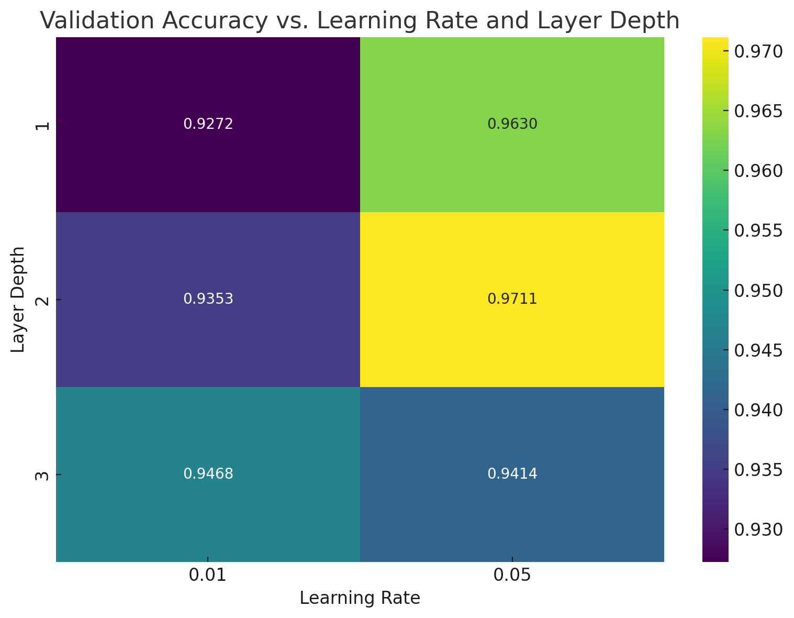

#  Neural Network Optimization

## Project Title

**Training a Neural Network: An Optimization Showdown**

---

##  Objectives

* Understand the concept of optimization in neural networks.
* Explore the effects of learning rate, batch size, and regularization.
* Learn how hyperparameter choices affect model performance and generalization.

---

##  Description

In this project, a simple feedforward neural network was trained on the **MNIST digit classification** dataset using two optimization techniques:

* **Stochastic Gradient Descent (SGD)**
* **Backtracking Line Search**

The same architecture was used for both optimizers to ensure a fair comparison. We tracked model performance over training epochs using:

* Training and validation loss
* Training and validation accuracy

Hyperparameters explored:

* Learning rate
* Batch size
* Number and size of hidden layers

---

##  Deliverables

* Jupyter Notebook with model and optimizer implementations
* Training logs and performance plots
* Experiment notes
* Optimizer comparison and justification
* Trade-off analysis (e.g., convergence speed vs. stability)
* Hyperparameter tuning insights

---

## Experiment Notes

A simple neural network with ReLU activations was trained for 10 epochs using both SGD and Backtracking Line Search. Extensive hyperparameter tuning was done to evaluate how architectural and optimization choices impact performance.

---

## Which Optimizer Performed Best and Why?

**Backtracking Line Search** performed best. It reached **97.19% validation accuracy** within just 10 epochs. Its dynamic adjustment of learning rate enabled fast, stable convergence with very low training loss. In contrast, **SGD** peaked at **92.11%** and required careful manual tuning of the learning rate.

---

## Trade-Offs Observed

* **SGD**: Slower to converge and sensitive to learning rate but computationally cheaper per step.
* **Backtracking**: More stable and faster convergence, but computationally heavier due to repeated line search evaluations.

---

## Hyperparameter Tuning Insights

* **Best configuration**: `[256, 128, 64]` hidden layers, batch size `32`, learning rate `0.05` achieving **97.57% validation accuracy**.
* Models with **deeper architectures** performed better than shallow ones.
* Higher learning rates like **0.05** generalized better than 0.01.
* Smaller batch sizes offered better generalization in most cases.

---

## Heatmap: Validation Accuracy vs. Learning Rate and Layer Depth

This heatmap shows that deeper networks (layer depth = 3) combined with a learning rate of 0.05 yield the highest validation accuracy.

---
